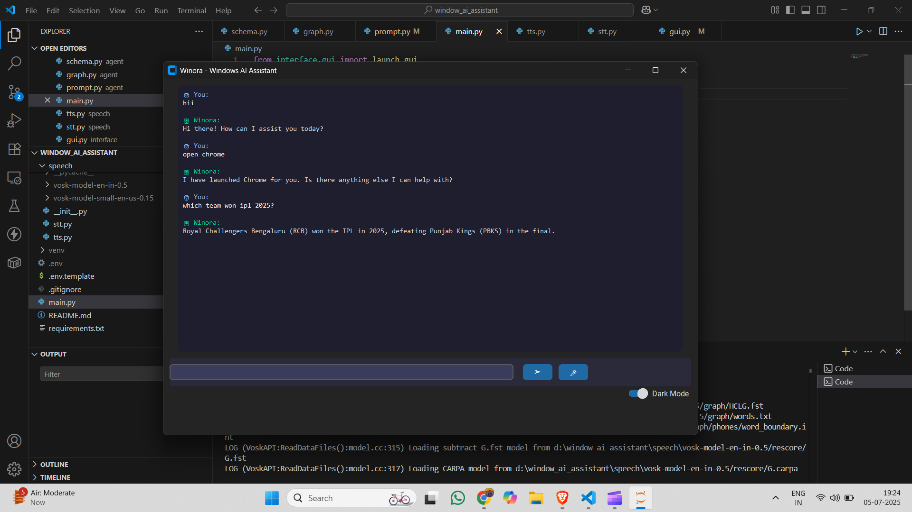

# 🪟 Windows Assistant — Your AI-Powered Desktop Agent

A smart, local-first Windows assistant powered by **Gemini**, **LangGraph**, and **LangChain tools** — built with Python and a simple GUI in **Tkinter**.

---

## 📦 Features

| Category              | Capabilities                                                                 |
|-----------------------|------------------------------------------------------------------------------|
| 💻 System Interaction | Launch installed apps, control brightness/volume, shutdown/restart system   |
| 🧠 AI Intelligence     | Chat with an LLM (via Gemini API) using ReAct + tools                 |
| 📸 Screenshots         | Take and auto-name screenshots like `ss_2025-06-06_1930.png`                |
| 🔋 System Info         | Get CPU, RAM, battery stats                                                 |
| 🌐 Web Tooling         | Use Tavily API (or similar) for online search queries                       |
| 🪄 GUI                 | Simple desktop interface using Tkinter                                      |

---

## 🗂️ Project Structure

```bash
windows_assistant/
├── .env # 🔐 API keys and model IDs
├── .env.template #template for .env file.
├── main.py # 🎯 Entry point to run the assistant
│
├── agent/
│ ├── graph.py # LangGraph agent with ReAct logic
│ ├── tools.py # All LangChain-compatible system tools
│ ├── schema.py #arguments schemas for tool.
│ └── prompt.py # ReAct-style prompt templates
│  
├── speech/
│ ├──model_name #keep model folder here (model for stt(speech to text))
│ ├──__init__.py 
│ ├──stt.py #t speech to text(using Vosk)
│ ├──tts.py # text to speech (using AWS Polly)
│
├── core/
│ ├── app_launcher.py # Open Start Menu apps
│ ├── system_info.py # CPU, battery, RAM checks
│ ├── system_control.py # Brightness, volume, shutdown
│ └── screenshot.py # Save smart-named screenshots
│
├── interface/
│ └── gui.py # Tkinter GUI
│
├── config/
│ └── settings.py # Load environment variables from .env
│
├── requirements.txt # All dependencies
├── .gitignore #files not be pushed .
└── README.md # Project details.
```

---

## 🚀 Getting Started

### 1. Clone the Repository
```bash
git clone https://github.com/yourusername/windows_assistant.git
cd windows_assistant
```

### 2. Create Virtual Environment
```bash
python -m venv venv
venv\Scripts\activate  # On Windows  source venv/bin/activate for mac /linuix
```
### 3. Install Dependencies
```bash
pip install -r requirements.txt
```
### 4. Set Up Environment Variables
```bash 
# Windows
copy .env.template .env
# macOS/Linux
cp .env.template .env
```
#### Then open .env and fill in the required credentials or keys.

### 5. Usage

Run the assistant:

```bash
python main.py
```

Try typing commands like:

* `Open Spotify`
* `Launch Notepad`
* `Tell me a joke`
* `What's the weather today?`

The assistant will either launch the app or respond conversationally.

---
## 🧠 How It Works
#### The assistant uses LangGraph + ReAct agent to think step-by-step before taking actions. The LLM is able to:

* `Answer basic queries (LLM knowledge)`

* `Use tools like launch_app, take_screenshot, or search_web`

* `Decide on-the-fly using reasoning before calling a tool`

## 💬 Voice Interaction Flow
### 🗣️ Speech-to-Text (STT)
* `Uses Vosk for local, offline voice recognition.`

* `Converts spoken queries to text.`

* `Fast and works without internet.`

* `Requires you to download a Vosk model:`
### 🔊 Text-to-Speech (TTS)
* `Uses AWS Polly to synthesize natural-sounding speech.`

* `You can change the voice (e.g., Joanna, Matthew) or use Neural engine.`

* `TTS response is streamed and played instantly using simpleaudio.`

## demo image 

## 👨‍💻 Author
Built by Sawan Kumar . Contributions welcome!